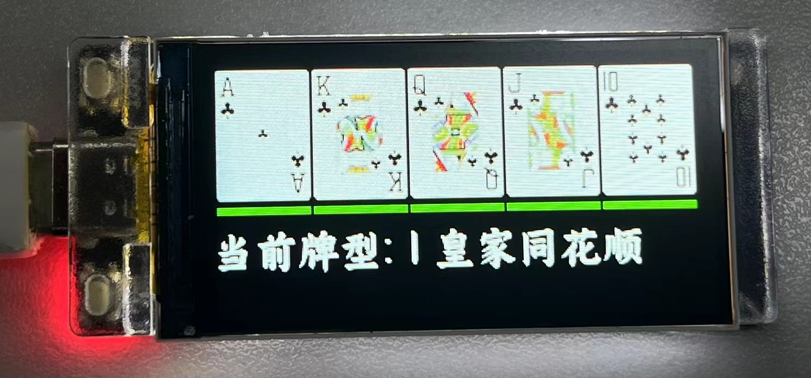
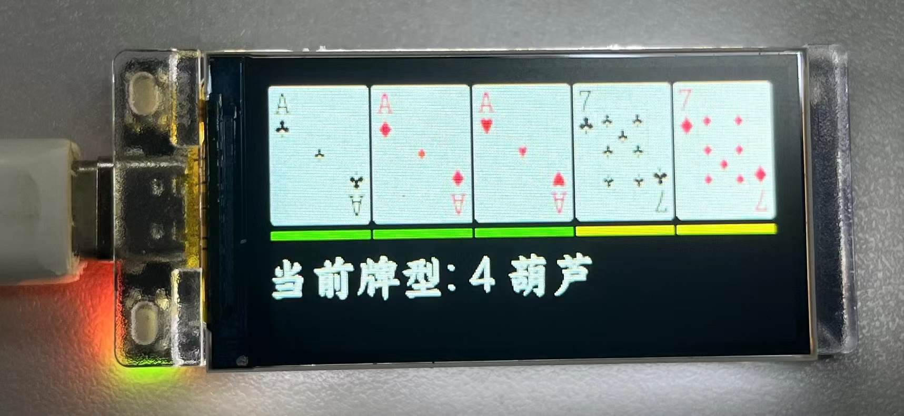

# ESP32 德州扑克牌型提示

本项目使用一块仿 LILYGO T-Display-S3 开发进行开发测试。在屏幕上显示德州扑克中的十种牌型大小。

## 功能特性
- MCU: ESP32S3
- 屏幕驱动: ST7789
- 屏幕尺寸: 170 x 320

## 安装使用

1. 克隆项目到本地
2. 打开 PlatformIO 并导入项目
3. 在 TFT_eSPI 库中配置屏幕驱动
4. 测试上传

